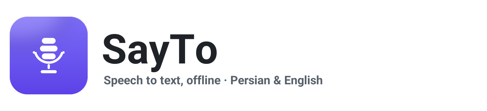

<div align="center">



**Offline speech-to-text for Windows — Persian & English**

Type with your voice in **any app** — 100% offline, no cloud, no account.

[](https://dotnet.microsoft.com/)
[](https://alphacephei.com/vosk/)
[](#)
[](LICENSE)
[](#features)

</div>

---

SayTo is a lightweight, portable dictation tool. Press a hotkey anywhere in Windows, speak, and your words are typed at the caret — exactly like Gboard voice typing, but fully offline and privacy-friendly.

## Features

- 🎙️ **Live dictation** — text appears word-by-word while you speak
- ⌨️ **Works in every app** — Word, browsers, chat apps… press the global shortcut and talk
- 🔒 **100% offline** — powered by [Vosk](https://alphacephei.com/vosk/); no audio ever leaves your device
- 🇮🇷 **Persian & English** — switch recognition language with one click
- 🪶 **Portable** — a single folder, no installer, no admin rights; runs from a USB stick
- 🌗 **Modern UI** — dark/light theme, live waveform, bilingual interface (Fa/En), RTL-safe text
- ⏱️ **Auto-stop** — finishes automatically after a configurable moment of silence

## Download

1. Grab `SayTo-x.y.z-portable-x64.zip` from [Releases](../../releases)
2. Extract anywhere and run **`SayTo.exe`**
3. On first launch, download the speech models (~40–55 MB per language) — after that it works fully offline

> **SmartScreen note:** the exe is not code-signed. If Windows shows a warning, click
> *More info → Run anyway*. You can always build it yourself from source.

## Usage

| Action | How |
|---|---|
| Dictate into any app | Focus the app, press **`Ctrl+Alt+S`** (configurable), speak, press again to insert |
| Dictate inside SayTo | Click the big microphone button |
| Change language | `فارسی / English` switch in the title bar |
| Copy / Insert / Clear | Buttons under the transcript box |
| Auto-stop on silence | Settings → toggle + seconds slider |
| Close | SayTo keeps running in the system tray — double-click the tray icon to reopen |

### Tips for better accuracy
- Use a headset or a close microphone
- Speak naturally, at a steady pace
- The small models are tuned for short dictation phrases (best for voice typing, not long transcripts)

## Build from source

Requirements: [.NET 9 SDK](https://dotnet.microsoft.com/download/dotnet/9.0) (Windows).

```powershell
git clone https://github.com/<you>/SayTo.git
cd SayTo
dotnet build src/SayTo/SayTo.csproj -c Release

# portable release into dist\SayTo + zip
powershell -File scripts\build.ps1
```

Headless pipeline test (no GUI/microphone needed — great for CI):

```powershell
SayTo.exe --selftest path\to\file.wav --lang en
```

## Project layout

```
src/SayTo/            WPF application (.NET 9)
  Services/           recognition, model manager, audio, hotkeys, text injection
  Themes/             dark/light palettes + control styles
  Assets/             logo, icon, Vazirmatn font
logo/                 logo source (SVG + PNG)
scripts/              build.ps1, asset generators, test WAV maker
```

## Tech stack

- **C# / .NET 9 WPF** — single self-contained exe
- **[Vosk 0.3.38](https://github.com/alphacep/vosk-api)** (Apache-2.0) — offline Kaldi-based recognition
- Models: `vosk-model-small-fa-0.42`, `vosk-model-small-en-us-0.15` (Apache-2.0, from [alphacephei.com](https://alphacephei.com/vosk/models))
- **NAudio 3.0** — microphone capture (16 kHz mono)
- **[Vazirmatn](https://github.com/rastikerdar/vazirmatn)** font (OFL) for the Persian UI

## Privacy

All recognition runs locally with Kaldi/Vosk. There is **no telemetry, no network access at runtime** except the one-time model download.

---

<div dir="rtl" align="right">

## فارسی

**SayTo** یک ابزار دیکته‌ی صوتی سبک و پرتابل برای ویندوز است. کلید میانبر را در هر برنامه‌ای بزنید، صحبت کنید و متن مستقیماً در محل نشانگر تایپ می‌شود — درست مثل دیکته‌ی صوتی کیبرد گوگل، اما کاملاً **آفلاین** و بدون ارسال هیچ صدایی به اینترنت.

### امکانات

- 🎙️ نمایش **زنده‌ی متن** هنگام صحبت
- ⌨️ کارکرد در **همه‌ی برنامه‌ها** (Word، مرورگر، چت و…) با میانبر سراسری
- 🔒 کاملاً **آفلاین** با موتور Vosk — حریم خصوصی کامل
- 🇮🇷 پشتیبانی از **فارسی و انگلیسی** با یک کلیک
- 🪶 **پرتابل** — بدون نصب، بدون دسترسی ادمین، قابل اجرا از فلش
- 🌗 رابط کاربری مدرن با تم تیره/روشن و رابط دوزبانه

### نصب

۱. فایل `SayTo-x.y.z-portable-x64.zip` را از بخش [Releases](../../releases) بگیرید.
۲. در هر پوشه‌ای باز کنید و `SayTo.exe` را اجرا کنید.
۳. در اولین اجرا مدل‌های زبان (~۴۰ تا ۵۵ مگابایت) را دانلود کنید؛ پس از آن همه‌چیز آفلاین است.

> اگر ویندوز هشدار SmartScreen داد: **More info → Run anyway** (برنامه امضای دیجیتال ندارد).

### نکته‌ها

- میانبر پیش‌فرض **`Ctrl+Alt+S`** است و از تنظیمات قابل تغییر است.
- برای دقت بهتر از هدست استفاده کنید و عادی و پیوسته صحبت کنید.
- مدل‌های کوچک برای جمله‌های دیکته‌ی روزمره بهینه‌اند (نه پیاده‌سازی جلسات طولانی).
- برنامه هنگام بستن، در **سینی سیستم** می‌ماند تا میانبر همیشه کار کند؛ خروج از منوی راست‌کلیک آیکون.

</div>

## License

MIT — see [LICENSE](LICENSE). Speech models and third-party libraries keep their own licenses (Apache-2.0 / OFL).
